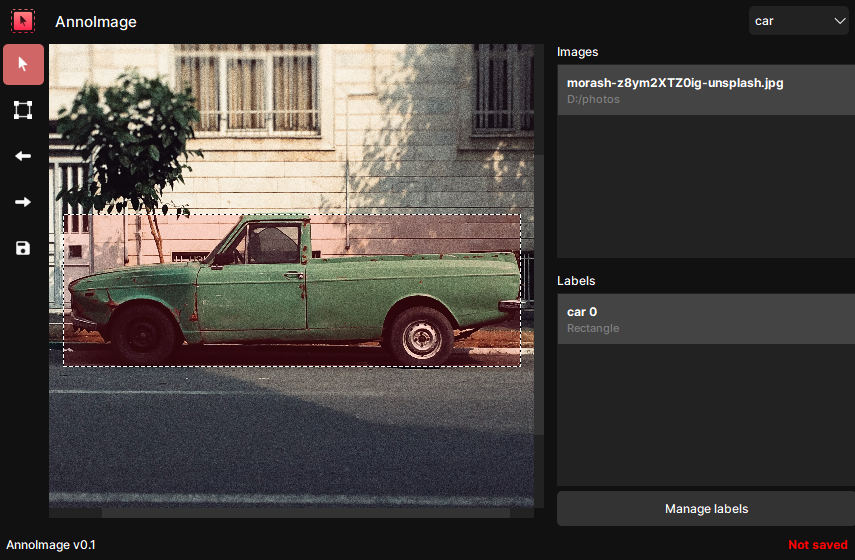

# AnnoImage

AnnoImage is an image annotation tool that allows you to annotate images for object detection.

It is written in **Python** and uses **PySide6** for the GUI.

Supported annotation types:
- [x] YOLO
- [ ] COCO

**(Work in progress)**
