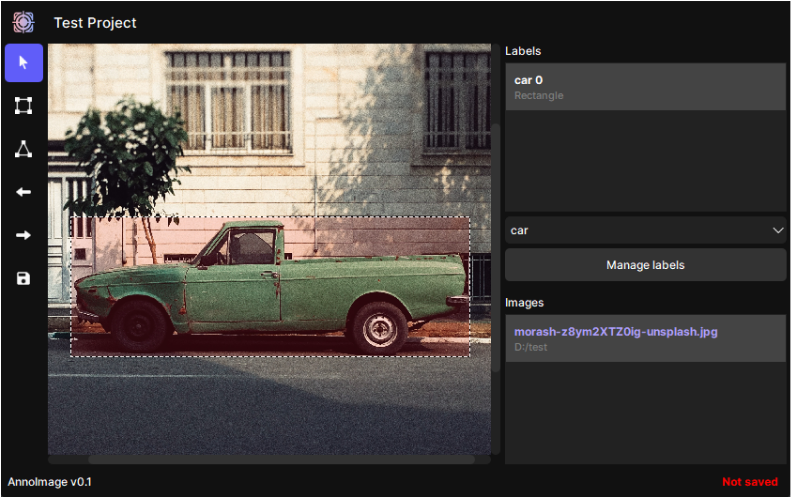

# AnnoImage: The Image Annotation Tool

**AnnoImage** is an intuitive and efficient image annotation tool designed for object detection tasks. It offers a user-friendly and fast way to mark elements in images, essential for projects involving machine learning and computer vision.

*(Image used in screenshot is from [Unsplash](https://unsplash.com/photos/green-single-cab-pickup-truck-parked-beside-building-z8ym2XTZ0ig?utm_content=creditShareLink&utm_medium=referral&utm_source=unsplash))*

## Key Features

- **Annotate Images for Object Detection**: Easily mark objects in your images with precision.

- **Project-Based Workflow**: Organize your annotation work within structured projects for better management.

- *(Work in progress)* **Export Annotations**: Export your annotations in multiple formats for compatibility with various ML models. 

- *(Coming soon)* **AI-Assisted Annotation**: Leverage AI tools to accelerate the annotation process.

## Getting Started

- [Installation Guide](./installation_guide.md)

- [Creating your First Project Guide](./first_project_guide.md)

- [Basic Annotation Guide](annotation_guide.md)

## License

AnnoImage is released under Apache-2.0 License, see [LICENSE](./LICENSE) for more details.

## Contact

For support, feedback, or inquiries, contact us [here](mailto:mikolajbadyl0@gmail.com).